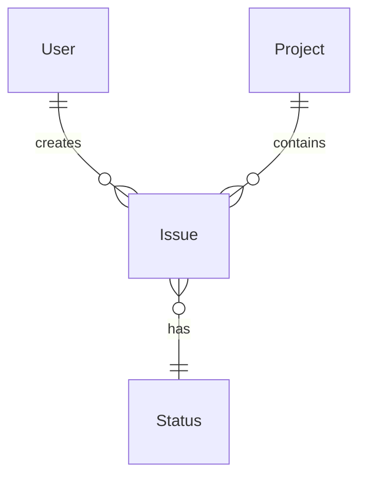
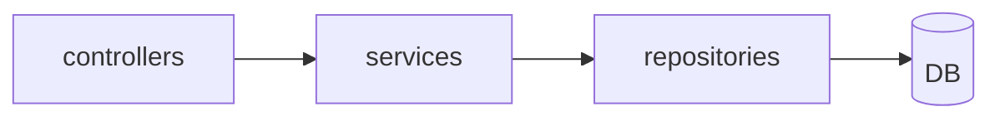
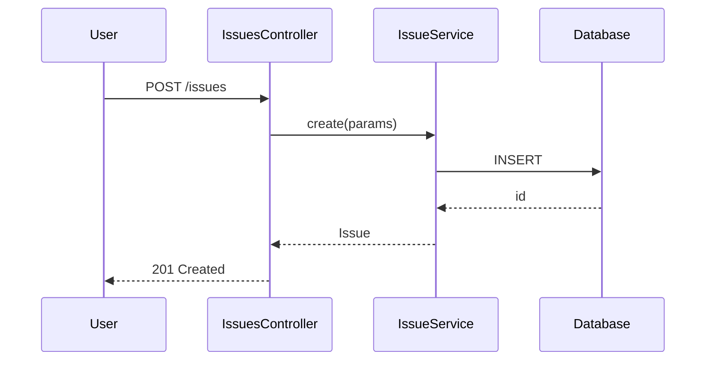
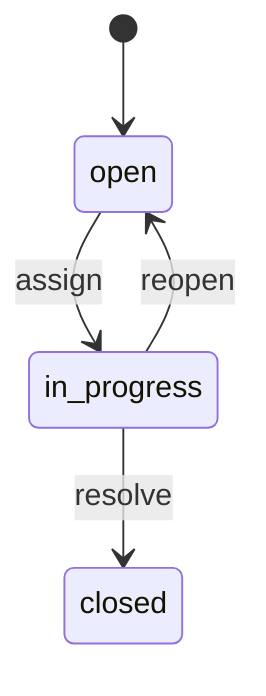

# Outline-mode "overview table" mapping per language

A catalogue of Layer 1 (always-fully-enumerated tables) used by cc-rsg's **outline mode**. For each language / framework, this document defines which abstractions to list as tables and which ripgrep patterns enumerate them exhaustively.

## Common policy

### 5 universal tables generated for every language

| Table | What goes in it | Language-independent meaning |
|---|---|---|
| **Modules** | Top-level responsibility partitions | Directories / packages |
| **Entities** | Types that represent "things" | Model / struct / type / class / interface |
| **Actions** | Boundaries that produce "behaviour" | Controllers / handlers / view functions / endpoints |
| **Data** | Persisted schema | DB schema / migrations / collections |
| **Dependencies** | External dependencies | Gems / pip / npm / inter-service integration |

These 5 tables exist as **abstractions in every language and framework** and form the backbone of the outline-mode spec.

### Confidence labels are mandatory (per table cell)

| Marker | Meaning | Grounding evidence |
|---|---|---|
| 🟢 **VERIFIED** | Confirmed by inspecting the real source | The file appears in the inspected-source history |
| 🟡 **INFERRED** | **Mechanically extracted** via ripgrep / imports / naming convention | The `rg` hit line can be cited as `[REF: path:Lstart-Lend]` |
| 🔴 **ASSUMED** | Inferred from framework "typical behaviour" (code unread) | Needs SME confirmation; pair with `[ASK SME]` marker |

**🟢 and 🟡 are source-derived (trustworthy). 🔴 is from the agent's knowledge base only (needs confirmation).**

### MECE-verification criteria (outline mode)

`scripts/coverage-check.py` mechanically checks:

1. **Full file enumeration**: every source file in the file tree appears **exactly once** in some row / cell / section of some table.
2. **VERIFIED ratio**: the percentage of entity rows with a 🟢 label (displayed as a KPI).
3. **🔴 ASSUMED ratio**: warning if it exceeds 60%.

---

## Ruby / Rails

### Modules table

| Directory | Role | How to confirm |
|---|---|---|
| `app/models/` | ActiveRecord models | `glob 'app/models/**/*.rb'` |
| `app/controllers/` | Controllers | `glob 'app/controllers/**/*.rb'` |
| `app/views/` | Templates | `glob 'app/views/**/*'` |
| `app/helpers/` | View helpers | `glob 'app/helpers/**/*.rb'` |
| `app/jobs/` | Background jobs | `glob 'app/jobs/**/*.rb'` |
| `app/mailers/` | Mailers | `glob 'app/mailers/**/*.rb'` |
| `lib/` | Project-specific library code | `glob 'lib/**/*.rb'` |
| `config/` | Configuration | `glob 'config/**/*.{rb,yml}'` |
| `db/migrate/` | Migrations | `glob 'db/migrate/*.rb'` |
| `plugins/` or `engines/` | Plugins / engines | `glob 'plugins/**/*' or 'engines/**/*'` |

### Entities table (Models)

Extraction pattern:
```
rg "^class (\w+)" --type ruby app/models/ -o
```

Columns:

| Class | File | Parent class | Main has_many / belongs_to | One-line summary | 🟢/🟡/🔴 |
|---|---|---|---|---|---|

Association extraction:
```
rg "^\s+(has_many|belongs_to|has_one|has_and_belongs_to_many)\s+:(\w+)" --type ruby
```

### Actions table (Controllers × Actions)

```
rg "^class (\w+Controller)" --type ruby app/controllers/ -o
rg "^\s+def (\w+)" app/controllers/specific_controller.rb
```

Routing:
```
view config/routes.rb
```

Columns:

| Controller#action | HTTP method | path | callback / before_action | One-line summary | 🟢/🟡/🔴 |
|---|---|---|---|---|---|

### Data table (DB schema)

```
view db/schema.rb  (or check config/database.yml)
view db/migrate/   (only the key migrations)
```

Columns:

| Table | Main columns | FK | Indexes | One-line summary | 🟢/🟡/🔴 |
|---|---|---|---|---|---|

### Dependencies table

```
view Gemfile
view Gemfile.lock (for the full list)
```

| Gem | Version | Purpose category | Touch points (file / line) | 🟢/🟡/🔴 |
|---|---|---|---|---|

---

## Python / Django

### Modules table

| Directory | Role |
|---|---|
| `<app>/models.py` or `<app>/models/` | Django models |
| `<app>/views.py` or `<app>/views/` | Views |
| `<app>/urls.py` | URL routing |
| `<app>/serializers.py` | DRF serializers |
| `<app>/admin.py` | Admin pages |
| `<app>/management/commands/` | Custom management commands |
| `<project>/settings.py` | Settings |
| `<app>/migrations/` | Schema migrations |

### Entities table (Models)

```
rg "^class (\w+)\(.*models\.Model.*\):" --type py
rg "^class (\w+)\(.*\):" --type py <app>/models/
```

Columns: Class / File / Parent class / Main ForeignKey / Manager / Summary / Confidence

### Actions table

Both class-based views and function views:
```
rg "^class (\w+)\(.*View.*\):" --type py
rg "^def (\w+)\(request" --type py
```

URLconf:
```
view <app>/urls.py
```

### Data table

For Django, follow the auto-generated migrations under `migrations/` chronologically to reconstruct the schema:
- Reverse-engineer the model state from the latest migration, or
- Reference an example output equivalent to `python manage.py dbshell` inside the skill (no execution needed).

---

## JavaScript / TypeScript / React

### Modules table

| Directory | Role |
|---|---|
| `src/pages/` or `src/app/` (Next.js) | Routes / pages |
| `src/components/` | UI components |
| `src/hooks/` | Custom hooks |
| `src/store/` or `src/state/` | State management |
| `src/lib/` or `src/utils/` | Utilities |
| `src/api/` or `src/services/` | API client calls |
| `public/` | Static assets |

### Entities table (React components / classes)

```
rg "^(?:export )?(?:default )?function (\w+)\s*\(" --type tsx
rg "^(?:export )?const (\w+)\s*=" --type tsx
rg "^(?:export )?class (\w+)" --type tsx
```

Columns: Component / File / Main props / Main state / Hooks used / Summary / Confidence

### Actions table (Routes / API endpoints)

Next.js App Router:
```
glob 'src/app/api/**/route.ts'
```

Express / Hono:
```
rg "(get|post|put|delete|patch)\(['\"]/" src/
```

### Data table

When using an ORM (e.g. Prisma):
```
view prisma/schema.prisma
```

State stores (Zustand / Redux) are also enumerated as a separate entities table:
```
rg "create<.*>\(\(" src/store/
```

---

## Go

### Modules table

| Directory | Role |
|---|---|
| `cmd/` | Entry points |
| `internal/` | Internal-only packages |
| `pkg/` | Public packages |
| `api/` | API definitions (OpenAPI / protobuf) |

### Entities table (Types)

```
rg "^type (\w+) struct" --type go
rg "^type (\w+) interface" --type go
```

Columns: Type / Kind (struct/interface) / File / Fields / Methods / Summary / Confidence

### Actions table (Handlers)

```
rg "^func.*\((?:c|ctx|r|req).*\)\s*\{" --type go
```

Routing:
```
rg "(GET|POST|PUT|DELETE|PATCH)\(['\"]/" --type go
```

---

## Java / Kotlin (Spring Boot)

### Modules table

| Directory | Role |
|---|---|
| `src/main/java/**/controller/` | Controllers |
| `src/main/java/**/service/` | Service layer |
| `src/main/java/**/repository/` | Repositories |
| `src/main/java/**/entity/` or `**/model/` | Entities |
| `src/main/resources/` | Configuration / migrations |

### Entities table

```
rg "@Entity" -A1 --type java
rg "^(public )?class (\w+)" --type java
```

### Actions table

```
rg "@(RestController|Controller|RequestMapping|GetMapping|PostMapping)" --type java
```

---

## Dart / Flutter

### Modules table

| Directory | Role |
|---|---|
| `lib/main.dart` | App entry (`runApp`) |
| `lib/features/<feature>/` or `lib/src/<feature>/` | Feature modules |
| `lib/**/screens/` or `**/pages/` | Screens / pages |
| `lib/**/widgets/` | Reusable widgets |
| `lib/**/models/` | Models / entities |
| `lib/**/repositories/` or `**/services/` | Data access / domain services |
| `pubspec.yaml` | Package + dependencies |

### Entities table (Widgets / models)

```
rg "^(abstract |final |sealed )*(class|mixin|enum|extension) (\w+)" --type dart
rg "extends (StatelessWidget|StatefulWidget)" --type dart
```

Columns: Name / Kind (widget/model/enum/mixin) / File / Fields or props / Summary / Confidence

### Actions table (Screens / routes / state)

```
rg "GoRoute\(|onGenerateRoute|Navigator\.(push|pushNamed)" --type dart
rg "extends (ChangeNotifier|Bloc<|Cubit<|StateNotifier<|GetxController)" --type dart
```

Columns: Screen or controller / Trigger / Route or method / State touched / Summary / Confidence

### Data table (local persistence)

```
rg "CREATE TABLE|openDatabase\(|@DriftDatabase|TypeAdapter" --type dart
```

Columns: Store (sqflite/Drift/Isar/Hive) / Table or box / Fields / Summary / Confidence

### Dependencies table

```
sed -n '/^dependencies:/,/^[a-z]/p' pubspec.yaml
```

Columns: Package / Purpose / Platform-specific? / Summary / Confidence

---

## Mermaid diagram templates

In outline mode, generate at least one of each as Layer 2:

### ER diagram (auto-derived from Entities + Data table)



### Module dependency diagram



### Sequence diagram (1-3 representative use cases)



### State-transition diagram (1-2 typical entities)



---

## Deep-dive candidate (Layer 3) selection criteria

In outline mode, every table ends with a **"Deep-dive candidates" section**. The agent prioritises these candidates in this order:

1. **Rows with high 🔴 ASSUMED ratio** (the agent could not confirm — may be important).
2. **High-complexity rows** (many methods, many associations, large files).
3. **Rows with unusual implementation patterns** (meta-programming, heavy callbacks, complex queries).
4. **Business-critical rows** (containing keywords like payment / auth / permission / audit log).

Candidate-list format (with IDs):

```markdown
### Deep-dive candidates (refer to them by ID)

- **D-001**: M-013 `Issue` class — authorisation guard logic [🔴 ASSUMED, complex]
- **D-002**: C-018 `ProjectsController#index` — visibility decision [🟡 INFERRED, business-critical]
- **D-003**: Sequence "Issue notification delivery" — subscribers resolution [unverified, complex]
- **D-004**: State transition "Issue#status` — transition validation [🔴 ASSUMED]
- **D-005**: Dependency "acts_as_searchable" — search backend [🟡 INFERRED]
```

When the user says `Deep-dive D-001` or `Tell me more about Issue authorisation`, the main agent recognises the ID and launches `chapter-investigator` (see Phase 6.5).
